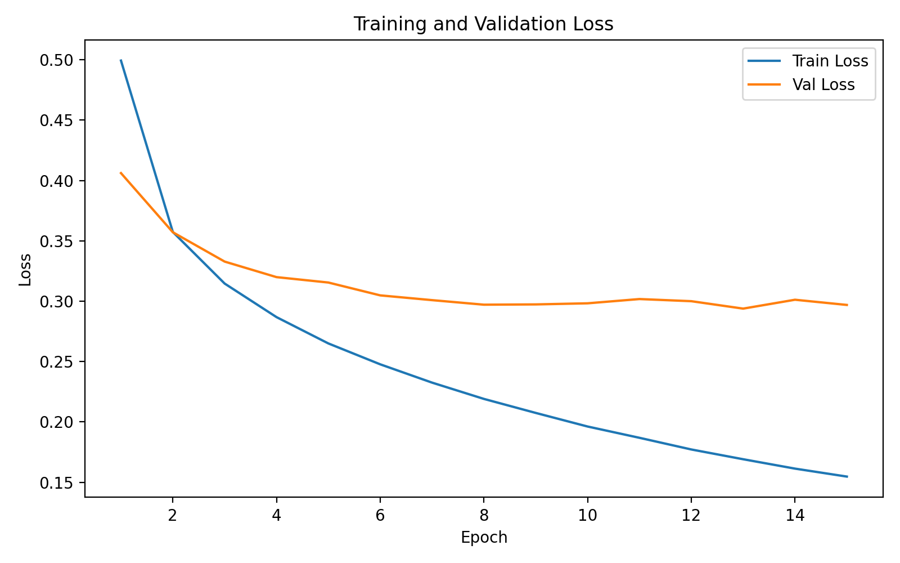
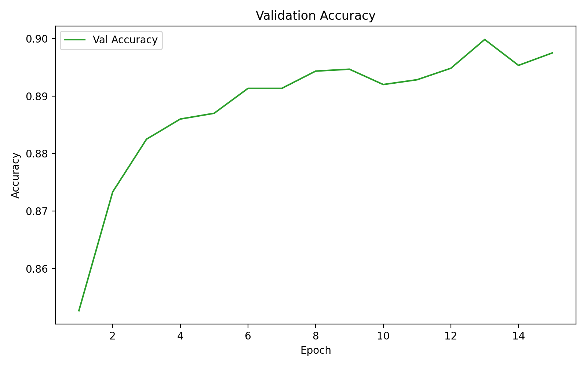
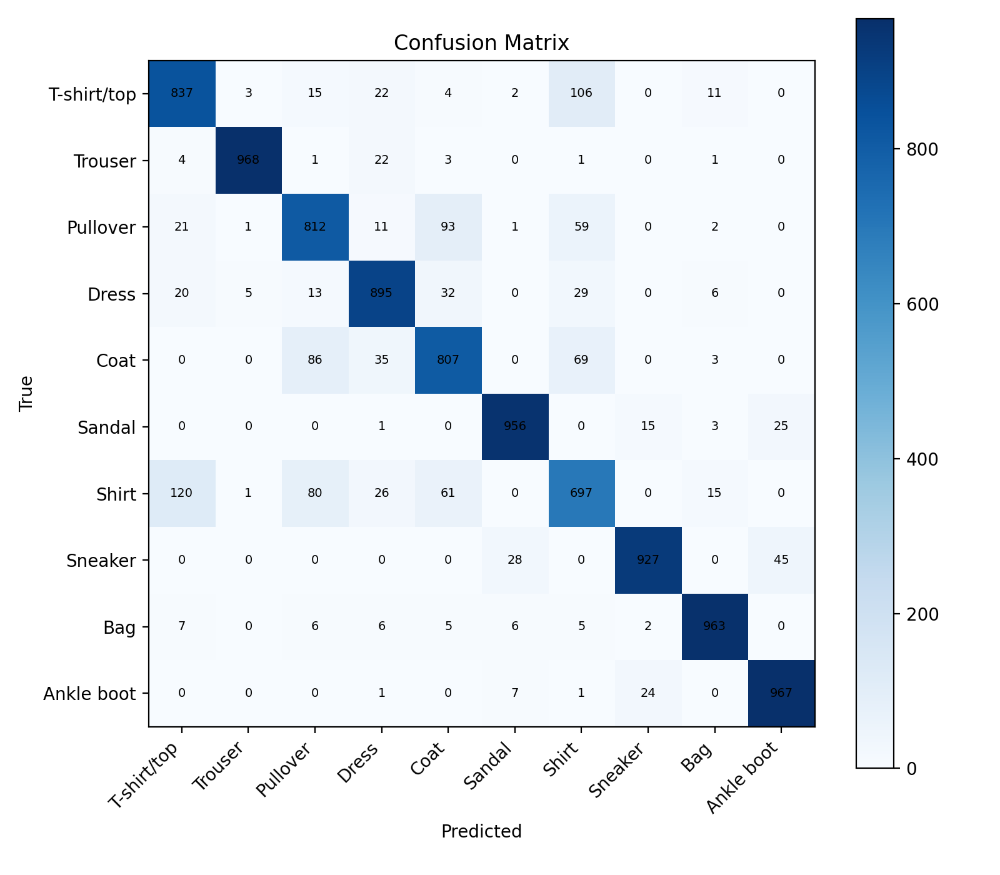
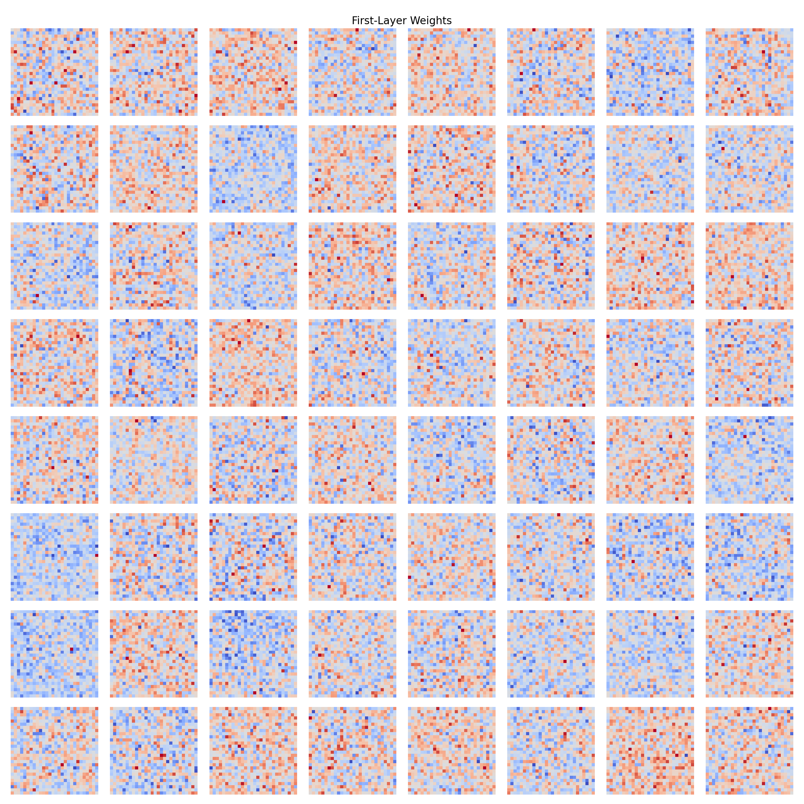
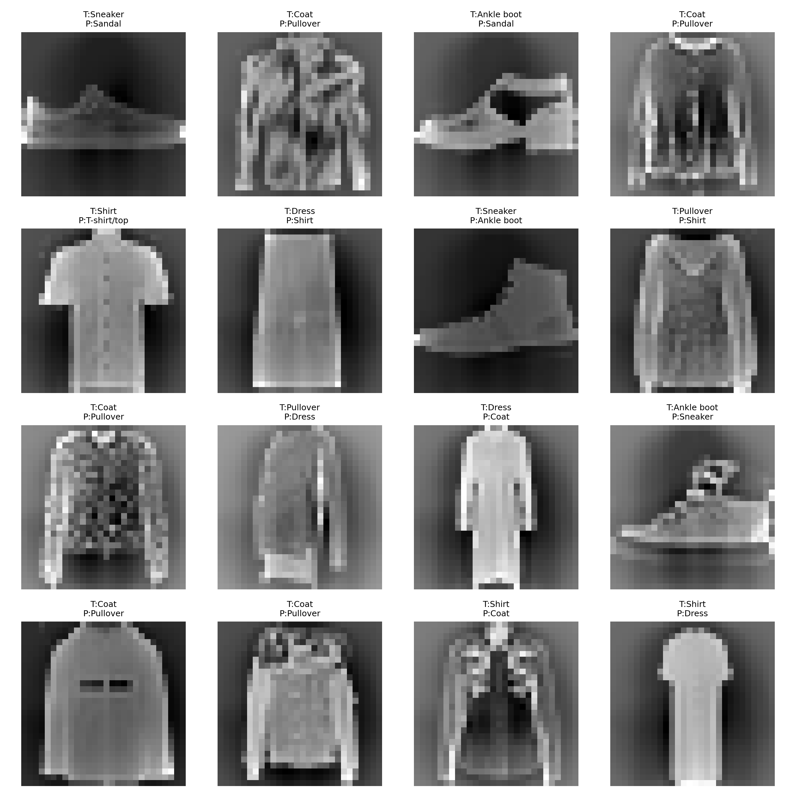

# HW1 实验报告

## 1. 实验任务

本次作业使用 `NumPy` 从零实现一个三层多层感知机分类器，在 `Fashion-MNIST` 数据集上完成 10 类服装图像分类。实验内容包括自动微分与反向传播实现、模型训练与验证、超参数搜索、测试集评估，以及权重和错分样本可视化分析。

## 2. 数据集与预处理

`Fashion-MNIST` 是一个经典的服装图像分类数据集，包含 10 个类别的灰度图像，每张图像大小为 `28 x 28`。

- 训练集：60000 张
- 测试集：10000 张
- 验证集：从训练集中随机划分出 10%

预处理流程如下：

1. 将每张图像展平成 `784` 维向量。
2. 将原始像素值从 `[0, 255]` 缩放到 `[0, 1]`。
3. 使用训练集的均值和标准差对训练集、验证集和测试集进行标准化。

这种处理方式有利于减小不同维度间的尺度差异，使模型训练更加稳定。

## 3. 模型设计

本实验实现的是一个三层全连接神经网络，结构为：

`784 -> 256 -> 256 -> 10`

其中前两层为隐藏层，最后一层输出 10 个类别的 logits。模型支持 `ReLU`、`Sigmoid` 和 `Tanh` 三种激活函数切换，正式实验中使用的是 `ReLU`。

### 3.1 自动微分与反向传播

为了满足“不使用 PyTorch / TensorFlow / JAX 自动微分”的要求，本实验自行实现了一个轻量级计算图系统。每个张量对象都保存当前数值、梯度、前驱节点以及对应的反向传播函数。在前向传播阶段构建计算图，在调用 `backward()` 时按照拓扑排序逆序执行各节点的梯度回传。

当前实现支持：

- 加法、减法、乘法
- 矩阵乘法
- 求和、求均值
- `ReLU`、`Sigmoid`、`Tanh`
- `log_softmax`
- 张量切片

交叉熵损失由 `log_softmax + negative log-likelihood` 构成，从而可以稳定地完成多分类训练。

## 4. 训练设置

正式实验采用如下超参数：

- `hidden_dim = 256`
- `activation = relu`
- `epochs = 15`
- `batch_size = 128`
- `learning_rate = 0.05`
- `lr_decay = 0.95`
- `min_lr = 1e-4`
- `weight_decay = 1e-4`
- `seed = 42`

优化器使用 `SGD`，每轮训练结束后将学习率乘以 `0.95`。训练过程中根据验证集准确率自动保存最优模型。

## 5. 训练结果可视化

### 5.1 Loss 曲线

训练集与验证集的 `Loss` 曲线如下图所示。

从实验日志可以看到，训练损失从第 1 个 epoch 的 `0.4993` 逐步下降到第 15 个 epoch 的 `0.1547`，说明模型能够持续拟合训练数据。验证损失整体也呈下降趋势，说明模型在前期和中期的泛化能力同步提升。

### 5.2 验证集 Accuracy 曲线

验证集准确率曲线如下图所示。

验证集准确率从 `0.8527` 持续提升，在第 13 个 epoch 达到最佳值 `0.8998`。这一结果说明学习率衰减策略有效提升了训练稳定性，两层隐藏层的三层 `MLP` 对 `Fashion-MNIST` 已具备较强表示能力。训练后期训练集准确率继续上升，而验证集提升趋于放缓，说明模型开始接近过拟合边界。

## 6. 超参数搜索

为了比较不同超参数组合对性能的影响，实验采用网格搜索调节了以下三类核心超参数：

- 隐藏层维度 `hidden_dim`
- 学习率 `learning_rate`
- 正则化强度 `weight_decay`

为了控制实验规模，激活函数固定为 `ReLU`，训练轮数固定为 `8`。

实验结果如下：

| hidden_dim | activation | learning_rate | weight_decay | best_val_acc |
| --- | --- | --- | --- | --- |
| 256 | relu | 0.05 | 0.0 | 0.8928 |
| 256 | relu | 0.05 | 1e-4 | 0.8923 |
| 128 | relu | 0.05 | 1e-4 | 0.8890 |
| 128 | relu | 0.05 | 0.0 | 0.8845 |
| 256 | relu | 0.01 | 1e-4 | 0.8743 |
| 256 | relu | 0.01 | 0.0 | 0.8735 |
| 128 | relu | 0.01 | 1e-4 | 0.8688 |
| 128 | relu | 0.01 | 0.0 | 0.8610 |

从结果可以得到以下结论：

- 较大的隐藏层维度通常带来更高的验证集准确率，说明更宽的隐藏层具备更强的表示能力。
- 较大的学习率 `0.05` 明显优于 `0.01`，说明在当前模型和数据集上，更积极的更新步长能更快达到较好解。
- `weight_decay = 0.0` 和 `1e-4` 的差距不大，但在不同隐藏层设置下都能观察到轻微影响，说明正则化强度也会改变模型表现。
- 在本次搜索中，最佳组合为 `hidden_dim = 256`、`learning_rate = 0.05`、`weight_decay = 0.0`，验证集准确率达到 `0.8928`。

搜索结果保存在：

- `outputs/search_required/search_results.json`

## 7. 测试集结果

使用验证集表现最好的模型在测试集上评估，得到：

- `Test Loss = 0.3392`
- `Test Accuracy = 0.8829`

测试集混淆矩阵如下图所示。

从混淆矩阵可以观察到以下现象：

- `Trouser`、`Bag`、`Ankle boot` 的识别效果较好，因为这些类别的轮廓更鲜明。
- `Shirt` 是最难识别的类别之一，经常被分成 `T-shirt/top`、`Pullover`、`Coat`。
- `Coat` 和 `Pullover` 之间也存在明显混淆，这与二者轮廓相近有关。
- 鞋类之间仍有少量混淆，例如 `Ankle boot` 有一部分被预测为 `Sneaker`。

## 8. 第一层权重可视化分析

第一层权重可视化如下图所示。

将第一层的权重矩阵从 `784` 维重新恢复成 `28 x 28` 图像后，可以发现若干典型模式：

- 一部分权重表现为明显的边缘检测器，对水平、竖直或斜向轮廓响应较强。
- 一部分权重更关注图像中央区域，说明网络学到了服装主体的整体位置分布。
- 还有一些权重在上半区域或下半区域有更强响应，可能对应领口、袖子、鞋底或裤腿等局部结构。

这说明即使是简单的全连接网络，在训练后也能自动学习到一些具有视觉意义的空间模式。

## 9. 错例分析

部分错分样本如下图所示。

对错分样本进行观察后，可以从以下角度理解错误原因：

- `Shirt` 和 `T-shirt/top` 的边界并不总是清晰，尤其在领口和袖口区域特征不明显时，模型较难准确区分。
- `Coat`、`Pullover`、`Shirt` 等类别都属于上衣类，整体外形相近，容易在低分辨率下混淆。
- 某些样本本身轮廓不完整，或者衣物与背景对比度较低，会影响模型对关键区域的判断。
- 本实验模型是纯全连接网络，没有显式利用局部卷积结构，因此对局部纹理和位移不变性的建模较弱。

## 10. 总结

本实验使用 `NumPy` 从零实现了一个支持自动微分和反向传播的三层 `MLP` 分类器，并完整完成了训练、验证、测试、超参数搜索以及可视化分析。在正式实验中，模型在验证集上取得了 `0.8998` 的最佳准确率，在测试集上取得了 `0.8829` 的准确率，说明该实现能够较好地完成 `Fashion-MNIST` 分类任务。

不过，从混淆矩阵和错例样本中也可以看出，纯全连接网络对于相似服装类别的区分能力仍有限。若继续改进，可以考虑：

- 增大搜索范围，进一步调节学习率和正则化强度
- 尝试更好的参数初始化方式
- 引入 `CNN` 结构，更充分地利用图像的局部空间信息
- 增加数据增强，提高模型的泛化能力

## 11. 附录

GitHub Repo 链接：

- https://github.com/jiab666/computer-vision-homework1

模型权重下载链接：

- https://raw.githubusercontent.com/jiab666/computer-vision-homework1/main/outputs/final_run/best_model.npz
